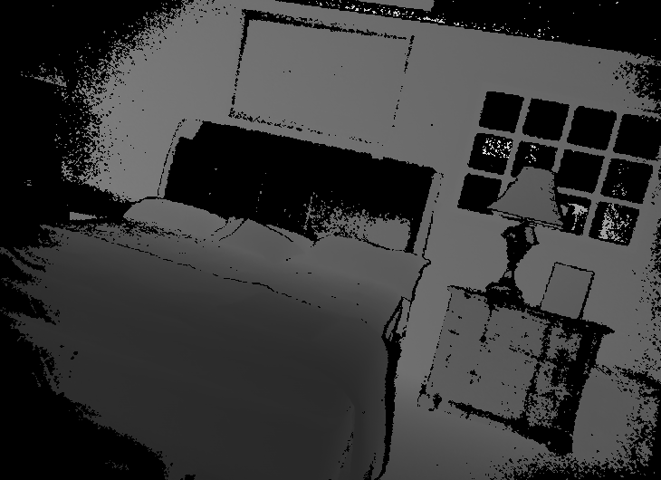

# Predict Depth map from  a single image using neural net pytorch

Predict depth map from image using neural net with pytorch the depth map 

The same code with train model included (run out of the box) could be download from: [1](https://icedrive.net/0/1c1qFyjiIb)
The net was trained using the SUN3D dataset that can be downloaded from [here](http://sun3d.cs.princeton.edu/) 
Based on paper [Depth Map Prediction from a Single Image using a Multi-Scale Deep Network](https://proceedings.neurips.cc/paper/2014/file/7bccfde7714a1ebadf06c5f4cea752c1-Paper.pdf) For more details

# Requirements
## Hardware
For using the trained net for prediction, no specific hardware is needed, but the net will run much faster on Nvidia GPU.

For training the net, an Nvidia GPU is needed (the net was trained on RTX 3090)

## Setup
Create a environment with the required dependencies ([Pytorch](https://pytorch.org/), torchvision, scipy and OpenCV, Open3D): *conda env create -f environment.yml*

## Software:
This network was run with Python 3.88 [Anaconda](https://www.anaconda.com/download/) with  [Pytorch 1.8](https://pytorch.org/) and OpenCV* package.
* Installing opencv for conda can usually be done using: pip install opencv-python or conda install opencv

# Prediction: running the trained net on  a single image

1. Train net or download code with pre-trained net weight from [1](https://icedrive.net/0/1c1qFyjiIb).
2. Open RunOnImage.py
3. Set image path to InputImage parameter
4. Set the path to the trained net weights  file in: Trained_model_path  (If you downloaded the code with the pre-train network from, the model path is already set) 
5. Run script to get prediction display on the screen.

## Training

1. Open Train.py
3. Set the path to TransProteus train folders parameter "Sun3DDir" in the input parameter section . 

4. Run the script
5. The trained net weight will appear in the folder defined in the  logs_dir 
6. For other optional training parameters, see the "Other training paramters" section in Train.py script

## Evaluating 

1. Train net or download code with pre-trained net weight from: [1](https://icedrive.net/0/1c1qFyjiIb)
2. Open EvaluateModel.py
3. Set a path to the trained net weights  file in: Trained_model_path  (If you downloaded the code with the pre-train network from  the model path is already set) 
4. Set Test data folder  path to the  Sun3EvalDDir parameter.
5Run the script

For other parameters, see the Input parameters section.

## More Info 
See paper [Depth Map Prediction from a Single Image using a Multi-Scale Deep Network](https://proceedings.neurips.cc/paper/2014/file/7bccfde7714a1ebadf06c5f4cea752c1-Paper.pdf) For more details

Input image

Predicted Depth Map
